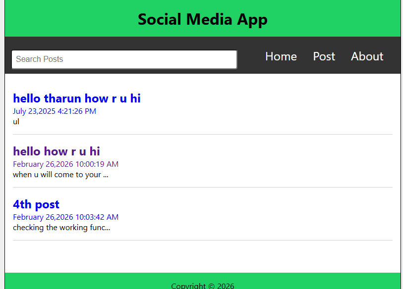
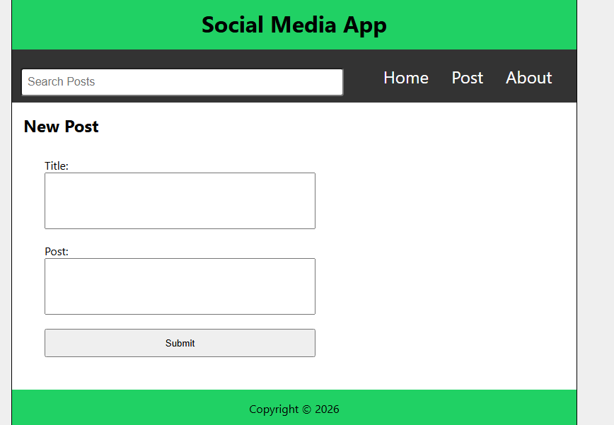
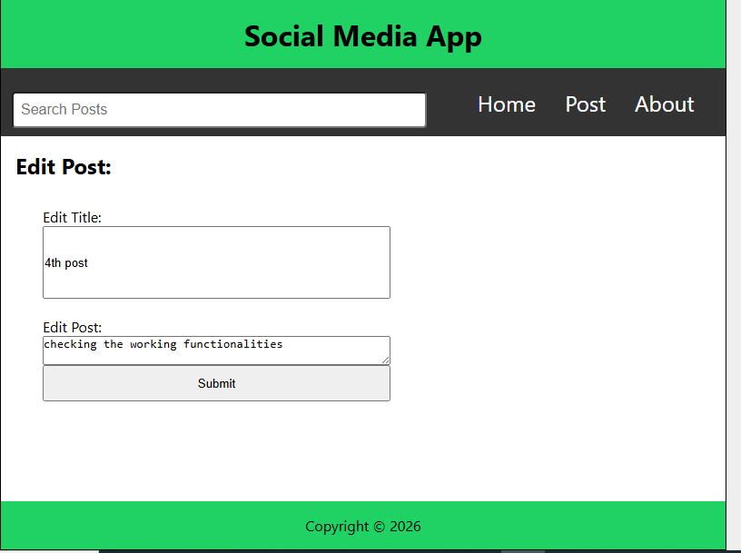
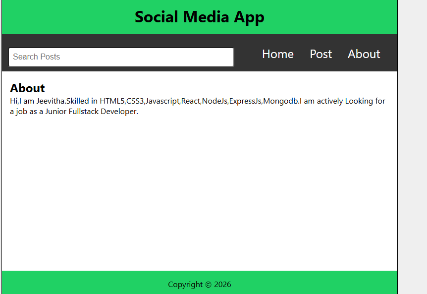

# 📱 Social Media Frontend App

A simple React-based social media application where users can create, edit, and delete posts.  
This project uses JSON Server as a mock backend to simulate real API interactions.

---

## 🚀 Features

### 🏠 Home Page
- Displays all posts
- Shows post preview (short content)

### ➕ Create Post Page
- Add new post
- Data stored in JSON Server

### ✏️ Edit Post Page
- Update existing post
- Changes reflect instantly

### 🗑️ Delete Post
- Remove post permanently

### ❓ Missing Page
- 404 page for invalid routes

### ℹ️ About Page
- Basic project information

---

## 🛠️ Tech Stack

- React (Create React App)
- React Router
- JSON Server (Mock Backend)
- CSS

---

## 📂 Project Structure

```
src/
 ├── components/
 ├── pages/
 ├── data/db.json
 ├── App.js
 └── index.js
```

---
## 📸 Screenshots

### 🏠 Home Page


### ➕ Create Post Page


### ✏️ Edit Post Page


### ℹ️ About Page


## ⚙️ Installation & Setup

### 1️⃣ Clone the repository

git clone https://github.com/Jeevitha-reactdeveloper/social-media-app-using-crud-operations.git
cd project-folder
```

### 2️⃣ Install dependencies

npm install
```

### 3️⃣ Start JSON Server

```cmd
npx json-server --watch data/db.json --port 3500
```

API will run at:

```
http://localhost:3500/posts
```

### 4️⃣ Start React App

npm start

Frontend runs at:

```
http://localhost:3000
```

---

## 📌 API Endpoints

| Method | Endpoint        | Description        |
|--------|-----------------|--------------------|
| GET    | /posts          | Get all posts      |
| GET    | /posts/:id      | Get single post    |
| POST   | /posts          | Create new post    |
| PUT    | /posts/:id      | Update post        |
| DELETE | /posts/:id      | Delete post        |

---

## 💡 Learning Outcome

- Implemented CRUD operations
- Integrated mock REST API
- Managed routing with React Router
- Handled dynamic URL parameters
- Practiced frontend + backend communication
